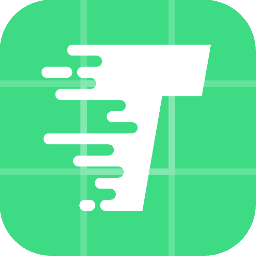

  
  <h1>T9启动器</h1>

---

## 技术栈

- Kotlin
- Jetpack Compose UI

## 项目背景

习惯了氢OS的上划九键搜索，换到 ColorOS 后虽然可以下划搜索，但是不带九键键盘、内容冗杂、体验很差。其他替代品大多不支持全拼，搜索速度慢，所以自己造一个。

## 安装应用

   - 

   - [Latest Release](https://github.com/h3110w0r1d-y/T9Launcher/releases/latest)

   > 关于 Xposed 版本：借助Xposed实现应用保活，保证每次使用时不用等待加载应用列表。Play商店版本无Xposed功能。

## 主要功能

- 支持全拼、首字母、多音字搜索
- 支持全拼/首字母混合输入（比如搜索“T9启动器”，可以输入qidq/qdongq/qdqi/qdq）
- 支持特殊字符(除中英文和数字外的字符)，使用0表示（比如搜索1DM+，可以输入1dm0）
- 支持英文通过空格、大写字母分词
- 支持自定义应用列表样式，包括每行显示的个数、高度、图标大小、圆角大小等
- 支持自定义键盘样式，包括键盘高度、宽度、底部边距
- 快速输入时不会丢字符（按下按钮后手指移出按钮范围再抬起，按下的数字也会上屏。同类竞品很多没实现这个功能，导致快速输入时有时输入不上）
- 支持隐藏系统应用、隐藏自定义应用

## 使用说明

- 长按`⚙️`进入设置界面
- 点击`⌫`删除一个字符，长按/滑动`⌫`清空所有输入
- 长按任意数字显示隐藏应用

## 搜索示例

- `冰箱IceBox` → `bxib`（支持大写首字母分词）
- `Bambu Handy` → `bh`（支持空格分词）
- `高德地图` → `gaodeditu`（支持全拼）
- `高德地图` → `gddt`（支持首字母）
- `高德地图` → `gdedt`（支持首字母+全拼混合）
- `高德地图` → `ditu`（支持从中间开始搜索）
- `QQ邮箱` → `qqyo`（支持最后一个字拼一半）
- `1DM+` → `1dm0`（支持特殊字符，用0表示）

如有建议或问题欢迎提交 Issue 反馈。
